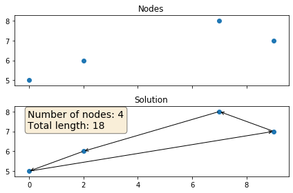

## TSP
Python Implementation for solving Travelling Salesman Problem using Hill Climbing Algorithm
#### Input
```
Input N: 4
```
#### Output

```
Random coordinates  {(7, 8), (2, 6), (0, 5), (9, 7)}
Distance matrix
 [[0 5 8 2]
 [5 0 2 7]
 [8 2 0 9]
 [2 7 9 0]]
Random first solution [0, 3, 1, 2]
Best solution [3, 0, 1, 2] 
Total length 18
```
